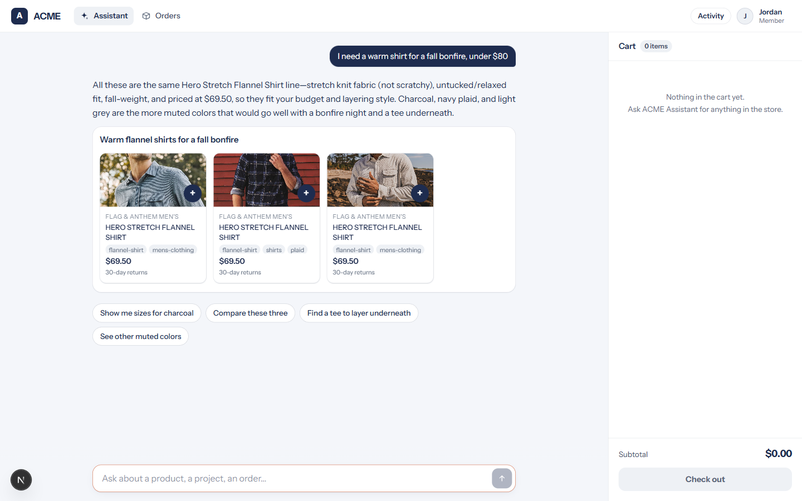
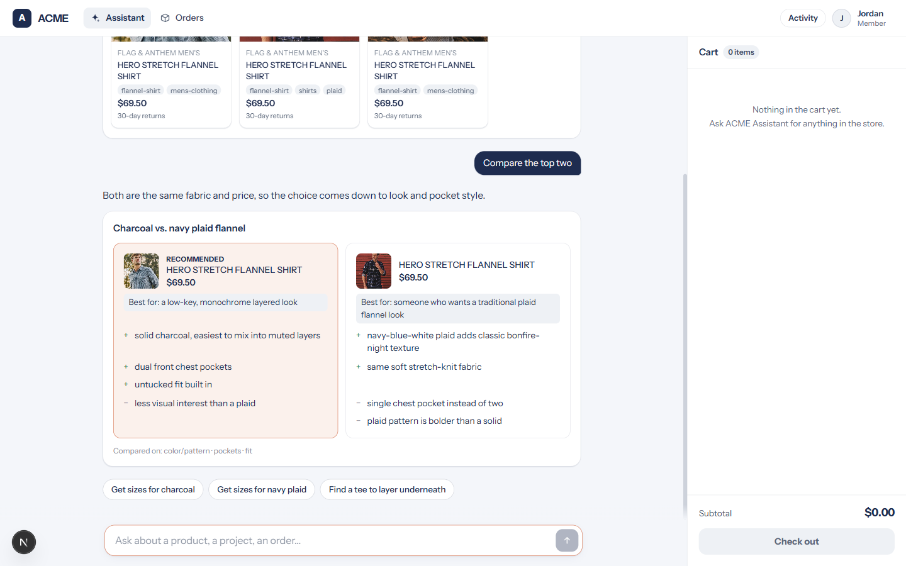
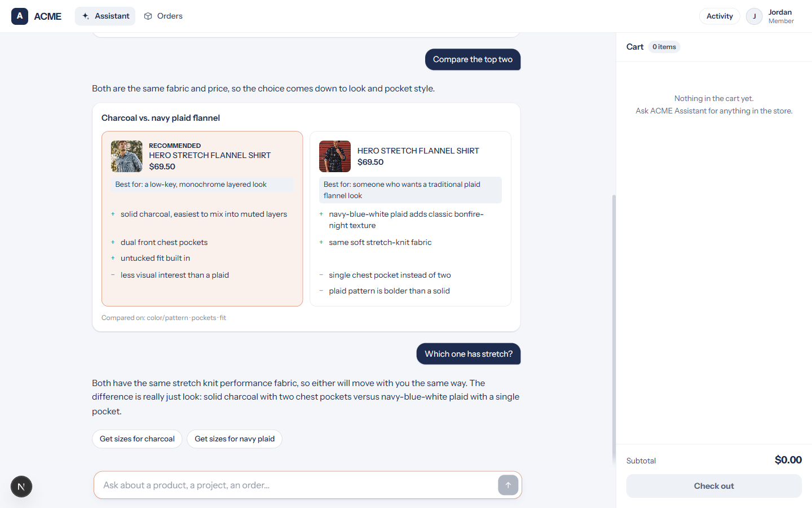

# One recorded run: Anthropic's retail storefront over `flag-and-anthem`

Recorded 2026-09-03 20:22 UTC on a Windows 11 laptop, Python 3.13.2, Node 23.7.0, upstream
commit `fd4d59224ab96b43c6dc6888207c67b3bd5a24cf`, model `claude-sonnet-5` (the blueprint's
default), XTAL at `https://www.xtalsearch.com`, collection `flag-and-anthem`, every call
`is_demo: true`. Started with `python scripts/run_demo.py`; driven by
`node scripts/demo_drive.js` in a headed Chromium (Playwright 1.58.2), a fresh session with
the memory store reset to the two seeded facts in `examples/retail_on_xtal/data/memory-seed.json`.

Timings come from two places. Per turn, the browser measured from the moment the chat
request left `fetch` to the first SSE frame of each type (`turns.json`, written by the drive
script). Per XTAL call, the API log line the backend writes carries XTAL's own `query_time`
and the HTTP round trip (`docs/demo/logs/api.log`, not committed). Nothing is rounded up.

## The three turns

### 1. "I need a warm shirt for a fall bonfire, under $80"

What the agent did, in order (times from the request leaving the browser):

| At | Tool | Input |
|---|---|---|
| 3,850 ms | `load_skill` | `search-discovery` |
| 6,200 ms | `search_products` | query `flannel shirt stretch fabric relaxed fit`; filters `category: shirts`, `max_price: 80`, `attributes: {fit: relaxed}` |
| 12,835 ms | `present_products` | three picks, carousel |
| 15,065 ms | `present_suggestions` | four chips |

The one XTAL call that search became:

| Field | Value |
|---|---|
| Request body | `query` as above, `limit` 8, `facet_filters: {"category": ["shirts"], "fit": ["relaxed"]}`, `price_range: {"max": 80}`, `search_source: commerce-agent`, `is_demo: true` |
| Rows returned | 8 of 8 |
| XTAL `query_time` | 1.4189534187316895 (as returned; the value is in seconds, though the docs say ms) |
| HTTP round trip | 1,888 ms |

Every row came back at $69.50, inside the band, so the mapper dropped nothing. Replaying
that body with curl after the run also returned 8 rows, none carrying a `fit_relaxed` tag,
so XTAL did not apply those facet filters as a hard cut on this call; the ranking carried
the query. (A `category` facet alone on this collection returns zero rows, which is why the
backend retries without facets on an empty result; that retry was not needed here.)

Browser timings for the turn:

| Event | ms after send |
|---|---|
| First SSE frame (the `load_skill` tool call) | 3,850 |
| First `text_delta` (time to first token) | 9,257 |
| First `ui` frame (the product carousel) | 12,854 |
| `turn_complete` | 15,070 |

The API log for the same turn: four model calls of 3,856, 2,336, 4,764, and 2,211 ms, then
the post-turn memory extraction on `claude-haiku-4-5-20251001`, 2,059 ms, off the response
path.

### 2. "Compare the top two"

| At | Tool | Input |
|---|---|---|
| 1,935 ms | `get_product_details` | `7793851662415` |
| 2,362 ms | `get_product_details` | `7544559730767` |
| 9,248 ms | `present_comparison` | color/pattern, pockets, fit; recommends `7793851662415` |
| 10,996 ms | `present_suggestions` | three chips |

Each details call is a search for the product's title and SKU, matched on id (XTAL has no
product-by-id route). Both hit:

| Call | Query length | Rows | XTAL `query_time` | HTTP round trip |
|---|---|---|---|---|
| details `7793851662415` | 39 chars | 12 | 2.117508888244629 | 2,335 ms |
| details `7544559730767` | 38 chars | 12 | 1.7638435363769531 | 1,998 ms |

| Event | ms after send |
|---|---|
| First SSE frame | 1,935 |
| First `text_delta` | 5,750 |
| First `ui` frame (the comparison) | 9,303 |
| `turn_complete` | 11,060 |

Model calls: 2,357, 4,942, and 1,749 ms; memory extraction 1,736 ms.

### 3. "Which one has stretch?"

No XTAL call. The answer came from the `material` attribute already in context
(`stretch knit performance fabric` on both, from `product_attributes`), and the agent named
the pocket difference from the same records.

| Event | ms after send |
|---|---|
| First SSE frame, which was the first `text_delta` | 1,095 |
| `present_suggestions` | 2,439 |
| `turn_complete` | 2,457 |

One model call, 2,447 ms.

## Where the time goes

Across the run, XTAL answered three calls in 1.42, 2.12, and 1.76 seconds of its own
`query_time`. The rest of each turn is the model: a search turn is four model rounds
(load the skill, search, present, close), and the first token of the reply arrives after
the search result is back and the presenting round has started.

## What is upstream's, not this backend's

The storefront is Anthropic's ACME retail web app, unchanged, so the header says ACME, the
cart panel and its Check out button are on screen, and the product tiles print "30-day
returns" from the app's own copy. The agent has no cart, order, policy, or fulfillment
tools in this deployment (`enable_*` off), so nothing behind those elements is wired to
XTAL, and the assistant name in the API's config is "Flag & Anthem Assistant" even where
the page's own strings say ACME.
